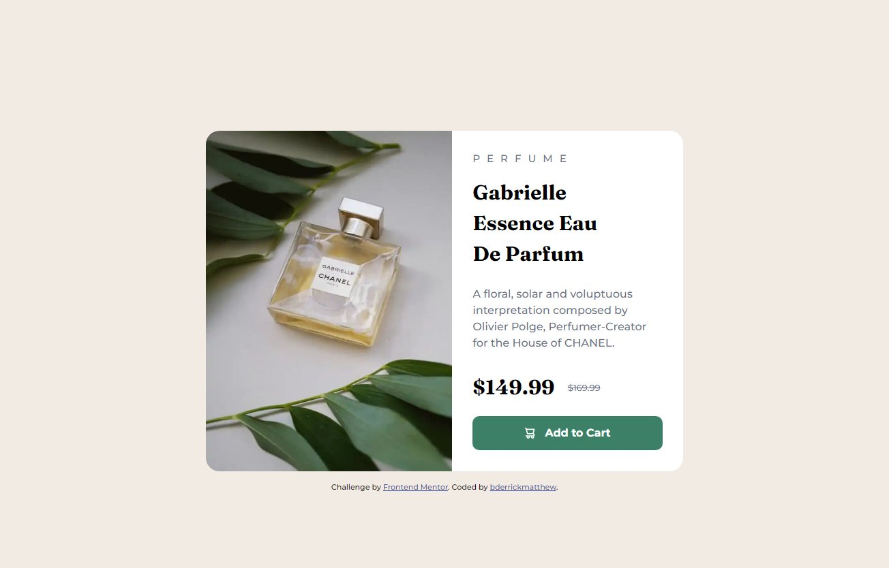

# Frontend Mentor - Product preview card component solution

This is a solution to the [Product preview card component challenge on Frontend Mentor](https://www.frontendmentor.io/challenges/product-preview-card-component-GO7UmttRfa). Frontend Mentor challenges help you improve your coding skills by building realistic projects. 

## Table of contents

- [Overview](#overview)
  - [The challenge](#the-challenge)
  - [Screenshot](#screenshot)
  - [Links](#links)
- [My process](#my-process)
  - [Built with](#built-with)
  - [What I learned](#what-i-learned)
  - [Continued development](#continued-development)
  - [Useful resources](#useful-resources)
- [Author](#author)
- [Acknowledgments](#acknowledgments)


## Overview

### The challenge

Users should be able to:

- View the optimal layout depending on their device's screen size
- See hover and focus states for interactive elements

### Screenshot



Add a screenshot of your solution. The easiest way to do this is to use Firefox to view your project, right-click the page and select "Take a Screenshot". You can choose either a full-height screenshot or a cropped one based on how long the page is. If it's very long, it might be best to crop it.

Alternatively, you can use a tool like [FireShot](https://getfireshot.com/) to take the screenshot. FireShot has a free option, so you don't need to purchase it. 

Then crop/optimize/edit your image however you like, add it to your project, and update the file path in the image above.

**Note: Delete this note and the paragraphs above when you add your screenshot. If you prefer not to add a screenshot, feel free to remove this entire section.**

### Links

- Solution URL: [Add solution URL here](https://your-solution-url.com)
- Live Site URL: [Add live site URL here](https://your-live-site-url.com)

## My process

### Built with

- Semantic HTML5 markup
- CSS custom properties
- Flexbox
- CSS Grid
- Mobile-first workflow


### What I learned

The major item i learnt was the picture tag, got some help from the community "previously" so here's the code;

```html
<picture>
        <source srcset="./images/image-product-desktop.jpg" media="(min-width: 568px)">
        
</picture>
```
so basically one can set a different image to target a certain viewport.

I also learnt (finally) when to apply "`display: inline;`", and guess what, it worked, Ha! 
```css
.prices p {
  display: inline;
}
```
Hmmh, this one's interesting, I had to `display:inline` then add `position:relative` just so I could target the image specifically and it... worked!, but why?
```css
button img {
  display: inline;
  position: relative;
  top: 3px;
  margin-right: 10px;
}
```
Finally, phew!, I added `width` to the parent container `main` which is flex by the way;
```css
  main {
    display: flex;
    width: 700px;
    margin-top: 10em;
  }
```
but I had to add `flex-basis: 600px` to the child, `product_desc` so that the contents would fit properly side by side, and again, but why?
```css
  .product_desc {
    border-radius: 0 20px 20px 0;
    flex-basis: 600px;
    padding: 30px;
  }
```

### Continued development

- Flexbox is a main focus for the future, I am still looking to awaken its full potential.

### Useful resources

- [Custom CSS Reset](https://www.joshwcomeau.com/css/custom-css-reset/) - This helped me to properly reset CSS over different browsers. I really liked this and will use it going forward.

## Author

- Website - [Coming Soon...]()
- Frontend Mentor - [@bderrickmatthew](https://www.frontendmentor.io/profile/bderrickmatthew)
- Twitter - [@bderrickmatthew](https://www.twitter.com/bderrickmatthew)


## Acknowledgments

I would like to send my thanks to the Frontend Mentor community for their help.
